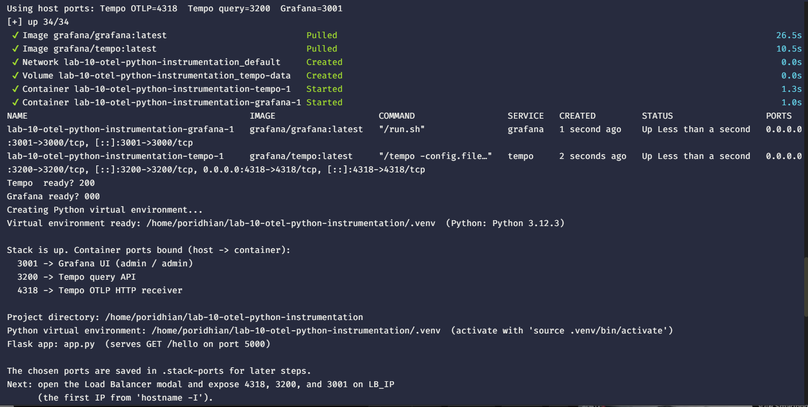
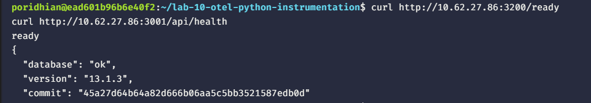
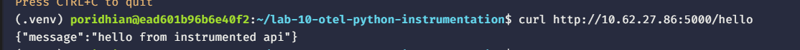
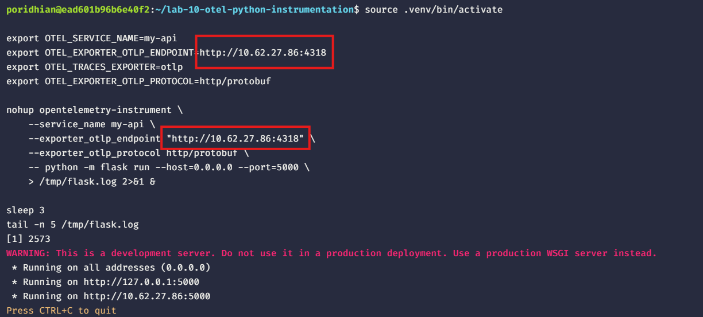
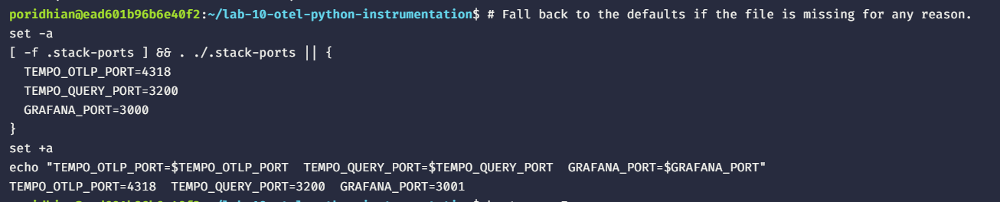

# Lab 10: Instrumenting a Python API with OpenTelemetry

Start the Grafana + Tempo stack on this container, install the OpenTelemetry distro and HTTP exporter, run a Flask API under the auto-instrumentation wrapper, and see a request trace land in Grafana Tempo.


## What You Will Build

- A `docker-compose.yml` running Grafana and Tempo, started fresh on this container.
- A Tempo config that opens an OTLP HTTP receiver.
- A provisioned Grafana datasource pointing at Tempo.
- A Python virtual environment with `opentelemetry-distro`, the OTLP HTTP exporter, and Flask instrumentation.
- A one-route Flask app served on port 5000.
- A wrapped launch that sends every request as a span to the local Tempo.

## Prerequisites

- Docker Engine with the Compose plugin.
- Python 3.10 or newer. The setup script installs `python3-venv` and `python3-pip` if missing.
- Host ports `4318`, `3200`, `3000`, and `5000` free. The setup script picks the next free port if any of the first three are already in use.

## Step 1 — Start the Grafana + Tempo stack

The bundled script `setup-lab9-stack.sh` writes the same files Lab 9 produces, brings the stack up, **and** bootstraps the Python venv + Flask app. It is idempotent — running it twice is safe.

```bash
mkdir -p lab-10-otel-python-instrumentation
cd lab-10-otel-python-instrumentation

# Pull the bundled setup script straight from the repo so the rest of
# this lab works without copying files by hand. Use the `Test` repo so
# you get the apt-first venv fix.
curl -fsSL -o setup-lab9-stack.sh \
  https://raw.githubusercontent.com/mahiiabdullah/Test/main/Labs/lab-10-otel-python-instrumentation/setup-lab9-stack.sh

chmod +x setup-lab9-stack.sh
./setup-lab9-stack.sh
```

If `curl` is missing, use `wget`:

```bash
wget -O setup-lab9-stack.sh \
  https://raw.githubusercontent.com/mahiiabdullah/Test/main/Labs/lab-10-otel-python-instrumentation/setup-lab9-stack.sh
chmod +x setup-lab9-stack.sh
./setup-lab9-stack.sh
```


The script:

1. **Always** runs `sudo apt update && sudo apt install -y python3.12-venv python3-pip` first (idempotent — apt skips already-installed packages), then prints a post-install sanity check so you can verify the venv module really did land before it's used. `python3.12-full` is the last-resort fallback if `ensurepip` is still missing.
2. Probes ports `4318`, `3200`, `3000` and picks the next free one for Tempo's OTLP receiver, Tempo's query API, and Grafana if any default is already in use.
3. Writes `docker-compose.yml`, `tempo.yml`, and the Grafana datasource provisioning file, then runs `docker compose up -d`.
4. Creates `.venv`, installs Flask + the OpenTelemetry packages into it, and drops `app.py` next to it.

Load the chosen ports into your shell so every later step can reference them:

```bash
# Fall back to the defaults if the file is missing for any reason.
set -a
[ -f .stack-ports ] && . ./.stack-ports || {
  TEMPO_OTLP_PORT=4318
  TEMPO_QUERY_PORT=3200
  GRAFANA_PORT=3000
}
set +a
echo "TEMPO_OTLP_PORT=$TEMPO_OTLP_PORT  TEMPO_QUERY_PORT=$TEMPO_QUERY_PORT  GRAFANA_PORT=$GRAFANA_PORT"
```



The health-check lines at the end of the script (`Tempo ready?` and `Grafana ready?`) should both report `200`. A `000` means the container is still booting — wait a few seconds and re-run `curl http://localhost:$TEMPO_QUERY_PORT/ready`.



## Step 2 — Expose the stack through the load balancer

Open the **Load Balancer** modal in the lab UI. Find the IP to enter:

```bash
hostname -I
```

Use the **first** IP printed as `LB_IP`. Expose three ports, one at a time — substitute the port numbers your script actually printed:

| Enter IP | Enter Port |
|---|---|
| `LB_IP` | `$TEMPO_OTLP_PORT` (Tempo OTLP) |
| `LB_IP` | `$TEMPO_QUERY_PORT` (Tempo query) |
| `LB_IP` | `$GRAFANA_PORT` (Grafana UI) |

Default values are `4318`, `3200`, and `3000`. If your script had to fall back to other ports because the defaults were already in use, use those instead.

You should see three entries in the modal's "Currently exposed" panel.

Verify the load balancer routes work:

```bash
curl http://<LB_IP>:${TEMPO_QUERY_PORT}/ready
curl http://<LB_IP>:${GRAFANA_PORT}/api/health
```

Both should return `200 OK` through the load balancer.

## Step 3 — Configure the OTLP exporter and start the wrapper

The setup script already created `.venv` and `app.py`. Activate the venv, point the OTLP exporter at the Tempo OTLP port the script actually bound, and run Flask under the wrapper in the background so it survives the next `curl` command. Stop it with `kill %1` (or `pkill -f 'flask run'`) when you finish.

```bash
source .venv/bin/activate

export OTEL_SERVICE_NAME=my-api
export OTEL_EXPORTER_OTLP_ENDPOINT=http://localhost:${TEMPO_OTLP_PORT}
export OTEL_TRACES_EXPORTER=otlp
export OTEL_EXPORTER_OTLP_PROTOCOL=http/protobuf

nohup opentelemetry-instrument \
    --service_name my-api \
    --exporter_otlp_endpoint "http://localhost:${TEMPO_OTLP_PORT}" \
    --exporter_otlp_protocol http/protobuf \
    -- python -m flask run --host=0.0.0.0 --port=5000 \
    > /tmp/flask.log 2>&1 &

sleep 3
tail -n 5 /tmp/flask.log
```



You should see `Running on http://0.0.0.0:5000`. The wrapper injects bytecode at import time so every Flask request becomes a span, and sends them to `localhost:${TEMPO_OTLP_PORT}` (the local Tempo).

## Step 4 — Expose the Flask port through the load balancer

Open the **Load Balancer** modal. Expose one more port:

| Enter IP | Enter Port |
|---|---|
| `LB_IP` | `5000` (Flask API) |

## Step 5 — Send one request through the load balancer

```bash
curl http://<LB_IP>:5000/hello
```



The JSON payload from the Flask handler should return. The wrapper has already exported the matching span to Tempo.

## Step 6 — View the trace in Grafana

Open `http://<LB_IP>:${GRAFANA_PORT}` in your browser, choose Explore, select the `Tempo` datasource, switch to **Search**, enter `my-api`, and click **Run query**.

The trace for `/hello` should appear with attributes such as `http.method=GET` and `http.route=/hello`.

## Next Steps

Stop the wrapped process with `kill %1`. Stop the stack with `docker compose down`. Remove the four ports from the Load Balancer modal. Lab 11 adds manual spans with `tracer.start_as_current_span` and custom attributes.