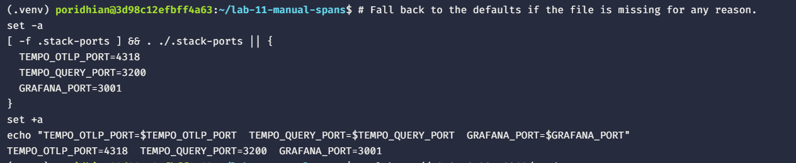
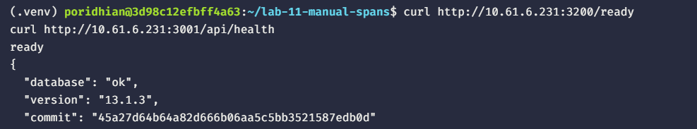
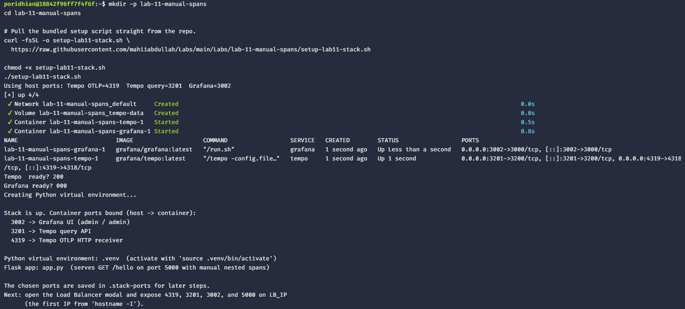
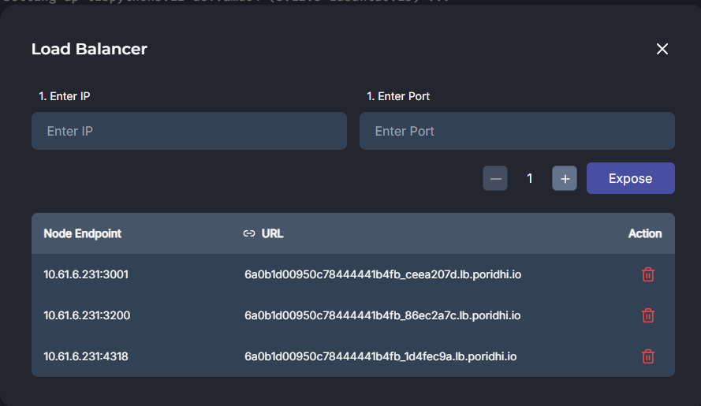
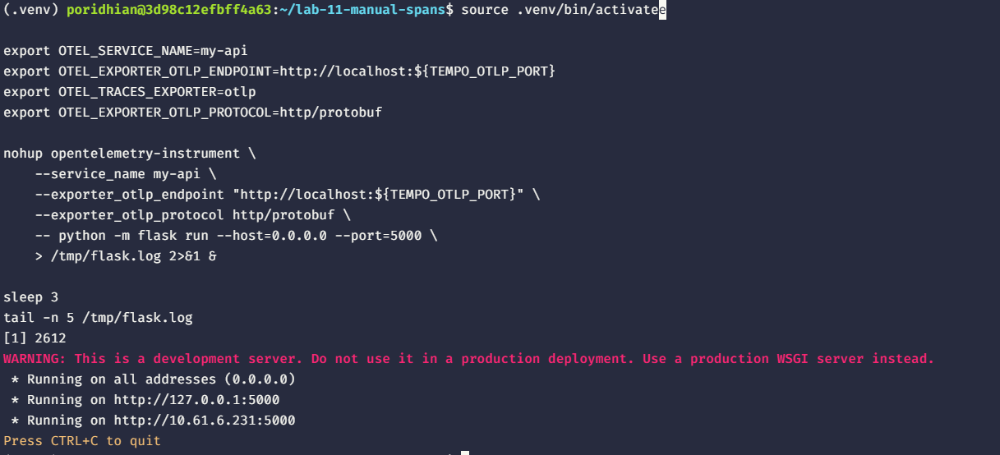
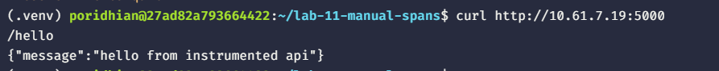

# Lab 11: Adding Manual Spans and Custom Attributes

Wrap a Flask route in `tracer.start_as_current_span`, attach domain attributes, and nest child spans to model a multi-step workflow.


## What You Will Build

- A Flask route with a root `handle_request` span carrying custom attributes (`user.id`, `request.id`).
- Two nested child spans: `db_lookup` and `cache_check`, each with its own attributes.

## Prerequisites

- Docker Engine with the Compose plugin.
- Python 3.10 or newer. The setup script installs `python3-venv` and `python3-pip` if missing.
- Host ports `4318`, `3200`, `3000`, and `5000` free. The setup script picks the next free port if any of the first three are already in use.

## Step 1 — Start the Grafana + Tempo stack and write the manual-spans app

The bundled script `setup-lab11-stack.sh` brings up the Tempo + Grafana stack (auto-picking free host ports), bootstraps the Python venv, installs Flask + the OpenTelemetry packages, and writes the **final** `app.py` — the version with the root span plus two nested children. It is idempotent.

```bash
mkdir -p lab-11-manual-spans
cd lab-11-manual-spans

# Pull the bundled setup script straight from the repo.
curl -fsSL -o setup-lab11-stack.sh \
  https://raw.githubusercontent.com/mahiiabdullah/Labs/main/Labs/lab-11-manual-spans/setup-lab11-stack.sh

chmod +x setup-lab11-stack.sh
./setup-lab11-stack.sh
```

If `curl` is missing, use `wget`:

```bash
wget -O setup-lab11-stack.sh \
  https://raw.githubusercontent.com/mahiiabdullah/Labs/main/Labs/lab-11-manual-spans/setup-lab11-stack.sh
chmod +x setup-lab11-stack.sh
./setup-lab11-stack.sh
```

Load the chosen ports into your shell so every later step can reference them:

```bash
# Fall back to the defaults if the file is missing for any reason.
set -a
[ -f .stack-ports ] && . ./.stack-ports || {
  TEMPO_OTLP_PORT=4318
  TEMPO_QUERY_PORT=3200
  GRAFANA_PORT=3000
}
set +a
echo "TEMPO_OTLP_PORT=$TEMPO_OTLP_PORT  TEMPO_QUERY_PORT=$TEMPO_QUERY_PORT  GRAFANA_PORT=$GRAFANA_PORT"
```



The health-check lines at the end of the script (`Tempo ready?` and `Grafana ready?`) should both report `200`. A `000` means the container is still booting — wait a few seconds and re-run `curl http://localhost:$TEMPO_QUERY_PORT/ready`.



## Step 2 — Expose the stack + Flask through the load balancer

Open the **Load Balancer** modal in the lab UI. Find the IP to enter:

```bash
hostname -I
```



Use the **first** IP printed as `LB_IP`. Expose four ports, one at a time — substitute the port numbers your script actually printed:

| Enter IP | Enter Port |
|---|---|
| `LB_IP` | `$TEMPO_OTLP_PORT` (Tempo OTLP) |
| `LB_IP` | `$TEMPO_QUERY_PORT` (Tempo query) |
| `LB_IP` | `$GRAFANA_PORT` (Grafana UI) |
| `LB_IP` | `5000` (Flask API) |

Default values are `4318`, `3200`, `3000`, and `5000`. Use whatever the script printed if it had to fall back.



Verify the load balancer routes work:

```bash
curl http://<LB_IP>:${TEMPO_QUERY_PORT}/ready
curl http://<LB_IP>:${GRAFANA_PORT}/api/health
```

Both should return `200 OK` through the load balancer.

## Step 3 — Run the wrapped Flask app

The setup script already created `.venv` and `app.py`. Activate the venv, point the OTLP exporter at the Tempo OTLP port the script actually bound, and run Flask under the wrapper in the background so it survives the next `curl` command. Stop it with `kill %1` (or `pkill -f 'flask run'`) when you finish.

```bash
source .venv/bin/activate

export OTEL_SERVICE_NAME=my-api
export OTEL_EXPORTER_OTLP_ENDPOINT=http://localhost:${TEMPO_OTLP_PORT}
export OTEL_TRACES_EXPORTER=otlp
export OTEL_EXPORTER_OTLP_PROTOCOL=http/protobuf

nohup opentelemetry-instrument \
    --service_name my-api \
    --exporter_otlp_endpoint "http://localhost:${TEMPO_OTLP_PORT}" \
    --exporter_otlp_protocol http/protobuf \
    -- python -m flask run --host=0.0.0.0 --port=5000 \
    > /tmp/flask.log 2>&1 &

sleep 3
tail -n 5 /tmp/flask.log
```



You should see `Running on http://0.0.0.0:5000`.

## Step 4 — Trigger a request

```bash
curl http://<LB_IP>:5000/hello
```



The Flask handler returns the JSON payload. The wrapper exports the trace to Tempo.

## Step 5 — Inspect the trace in Grafana

Open `http://<LB_IP>:${GRAFANA_PORT}`, choose Explore, pick the `Tempo` datasource, switch to **Search**, enter `my-api`, and click **Run query**.

The waterfall should show three rows:

- `handle_request` at the top, with attributes `user.id=u-42` and `request.id=r-1001`.
- `db_lookup` indented underneath, with `db.query_time_ms` and `db.system=postgres`.
- `cache_check` indented underneath, with `cache.lookup_time_ms` and `cache.hit=false`.

Inner `start_as_current_span` calls attach to the currently active span, which is why `db_lookup` and `cache_check` become siblings under `handle_request` rather than nested under each other.

## Next Steps

Stop the wrapped process with `kill %1`. Stop the stack with `docker compose down`. Remove the four ports from the Load Balancer modal. Lab 12 propagates the trace context from a Flask request into a Celery worker over Redis.