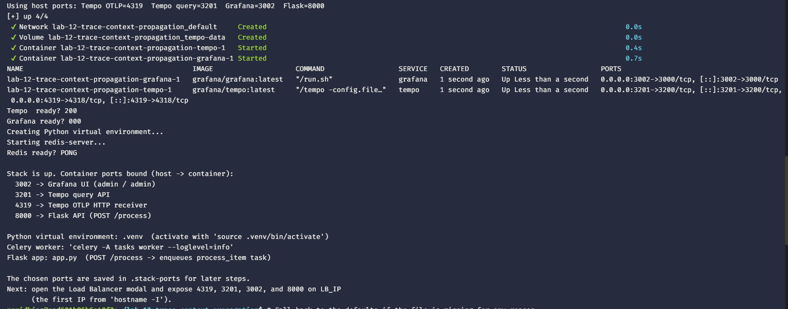
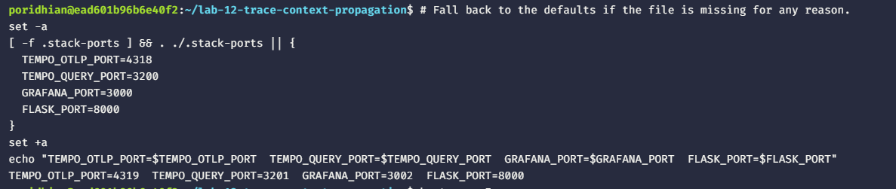
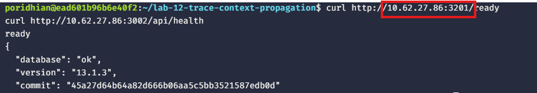
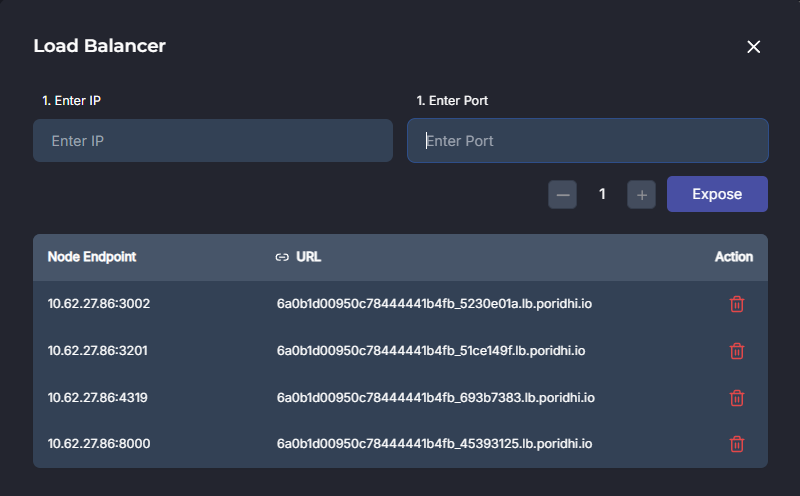
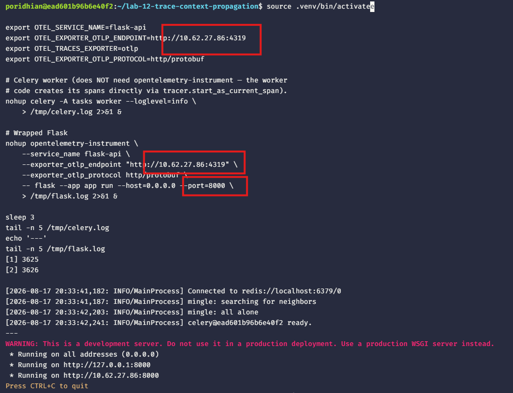
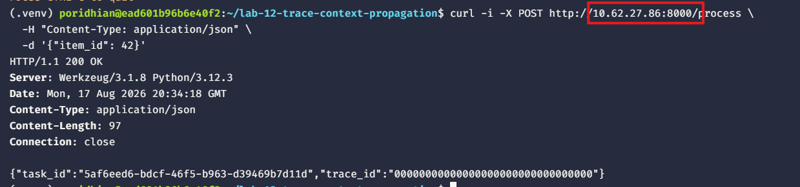

# Lab 12: Propagating Trace Context from Flask to Celery

Inject the active trace context from a Flask endpoint into a Celery task and extract it in the worker so both spans share one trace ID.


## What You Will Build

- A Flask API that enqueues Celery tasks through Redis.
- `propagate.inject(carrier)` in the Flask route and `propagate.extract(carrier)` in the worker.
- One trace in Tempo that contains both the Flask span and the worker span.

## Prerequisites

- Docker Engine with the Compose plugin.
- Python 3.10 or newer. The setup script installs `python3-venv` and `python3-pip` if missing.
- The setup script installs and starts `redis-server` if it is not already present.
- Host ports `4318`, `3200`, `3000`, and `8000` free. The setup script picks the next free port if any of the first four are already in use.

## Step 1 — Start the Grafana + Tempo stack, Redis, and the Celery + Flask app

The bundled script `setup-lab12-stack.sh` brings up the Tempo + Grafana stack, installs and starts Redis, bootstraps the Python venv with Flask + Celery + Redis + the OTel SDK, and writes `tasks.py` (worker side, `extract(carrier)`) and `app.py` (Flask side, `inject(carrier)`). It is idempotent.

```bash
mkdir -p lab-12-trace-context-propagation
cd lab-12-trace-context-propagation

# Pull the bundled setup script straight from the repo.
curl -fsSL -o setup-lab12-stack.sh \
  https://raw.githubusercontent.com/mahiiabdullah/Labs/main/Labs/lab-12-trace-context-propagation/setup-lab12-stack.sh

chmod +x setup-lab12-stack.sh
./setup-lab12-stack.sh
```

If `curl` is missing, use `wget`:

```bash
wget -O setup-lab12-stack.sh \
  https://raw.githubusercontent.com/mahiiabdullah/Labs/main/Labs/lab-12-trace-context-propagation/setup-lab12-stack.sh
chmod +x setup-lab12-stack.sh
./setup-lab12-stack.sh
```


Load the chosen ports into your shell so every later step can reference them:

```bash
# Fall back to the defaults if the file is missing for any reason.
set -a
[ -f .stack-ports ] && . ./.stack-ports || {
  TEMPO_OTLP_PORT=4318
  TEMPO_QUERY_PORT=3200
  GRAFANA_PORT=3000
  FLASK_PORT=8000
}
set +a
echo "TEMPO_OTLP_PORT=$TEMPO_OTLP_PORT  TEMPO_QUERY_PORT=$TEMPO_QUERY_PORT  GRAFANA_PORT=$GRAFANA_PORT  FLASK_PORT=$FLASK_PORT"
```

The health-check lines at the end of the script (`Tempo ready?`, `Grafana ready?`, `Redis ready?`) should report `200`, `200`, and `PONG` respectively. A `000` or `no` means the container is still booting — wait a few seconds and re-run.




> **Sanity check vs Lab 11.** The Lab 11 setup prints a slightly different tail (it does not install or start Redis). The lab-12 script exits with `Stack is up` followed by the four host → container port lines (3002 → Grafana, 3201 → Tempo query, 4319 → OTLP, 8000 → Flask). If you see this layout, the script ran the correct Lab 12 path. For comparison, the lab-11 boot output is also captured below.


Verify the load balancer routes work:

```bash
curl http://<LB_IP>:${TEMPO_QUERY_PORT}/ready
curl http://<LB_IP>:${GRAFANA_PORT}/api/health
```



Both should return `200 OK` through the load balancer.

## Step 2 — Expose the stack + Flask through the load balancer

Open the **Load Balancer** modal in the lab UI. Find the IP to enter:

```bash
hostname -I
```

Use the **first** IP printed as `LB_IP`. Expose four ports, one at a time — substitute the port numbers your script actually printed:

| Enter IP | Enter Port |
|---|---|
| `LB_IP` | `$TEMPO_OTLP_PORT` (Tempo OTLP) |
| `LB_IP` | `$TEMPO_QUERY_PORT` (Tempo query) |
| `LB_IP` | `$GRAFANA_PORT` (Grafana UI) |
| `LB_IP` | `$FLASK_PORT` (Flask API) |

Default values are `4318`, `3200`, `3000`, and `8000`. Use whatever the script printed if it had to fall back.



## Step 3 — Start the Celery worker and Flask app

The setup script already created `.venv`, started Redis, and wrote `tasks.py` + `app.py`. Now run the worker and the wrapped Flask app in the background so they survive the next `curl` command. Stop them with `kill %1 %2` when you finish.

```bash
source .venv/bin/activate

export OTEL_SERVICE_NAME=flask-api
export OTEL_EXPORTER_OTLP_ENDPOINT=http://localhost:${TEMPO_OTLP_PORT}
export OTEL_TRACES_EXPORTER=otlp
export OTEL_EXPORTER_OTLP_PROTOCOL=http/protobuf

# Celery worker (does NOT need opentelemetry-instrument — the worker
# code creates its spans directly via tracer.start_as_current_span).
nohup celery -A tasks worker --loglevel=info \
    > /tmp/celery.log 2>&1 &

# Wrapped Flask
nohup opentelemetry-instrument \
    --service_name flask-api \
    --exporter_otlp_endpoint "http://localhost:${TEMPO_OTLP_PORT}" \
    --exporter_otlp_protocol http/protobuf \
    -- flask --app app run --host=0.0.0.0 --port=${FLASK_PORT} \
    > /tmp/flask.log 2>&1 &

sleep 3
tail -n 5 /tmp/celery.log
echo '---'
tail -n 5 /tmp/flask.log
```



The worker log should show `ready`. The Flask log should show `Running on http://0.0.0.0:${FLASK_PORT}`.

## Step 4 — Trigger a request

```bash
curl -i -X POST http://<LB_IP>:${FLASK_PORT}/process \
  -H "Content-Type: application/json" \
  -d '{"item_id": 42}'
```



Save the `trace_id` from the JSON body. Both spans — the Flask `POST /process` and the worker's `celery-process` — share this trace ID because `inject(carrier)` wrote the W3C `traceparent` header into the task kwarg, and `extract(carrier)` rebuilt the same `Context` in the worker.

## Step 5 — Verify a single trace in Grafana

Open `http://<LB_IP>:${GRAFANA_PORT}`, choose Explore, pick the `Tempo` datasource, switch to **Search**, paste the `trace_id` from the previous step, and click **Run query**.

Exactly two spans appear: `POST /process` as the root and `celery-process` as a child with `item.id` and `worker.hostname` attributes.

## Next Steps

Stop the worker and the wrapped Flask app with `kill %1 %2`. Stop the stack with `docker compose down`. Remove the four ports from the Load Balancer modal. Lab 13 exposes the trace ID on the response header and uses the service graph to read aggregate latency.