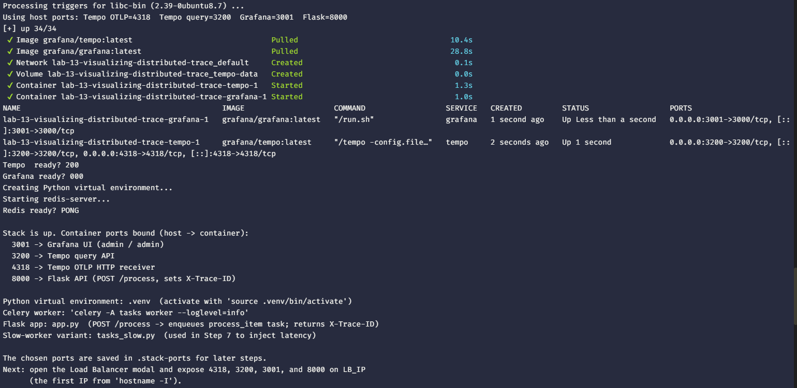
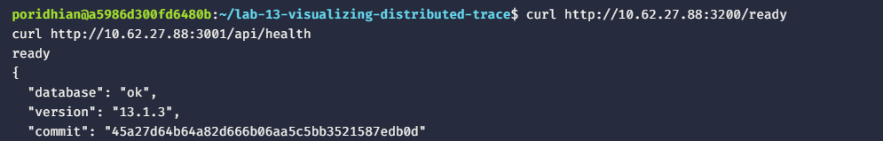
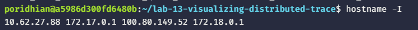
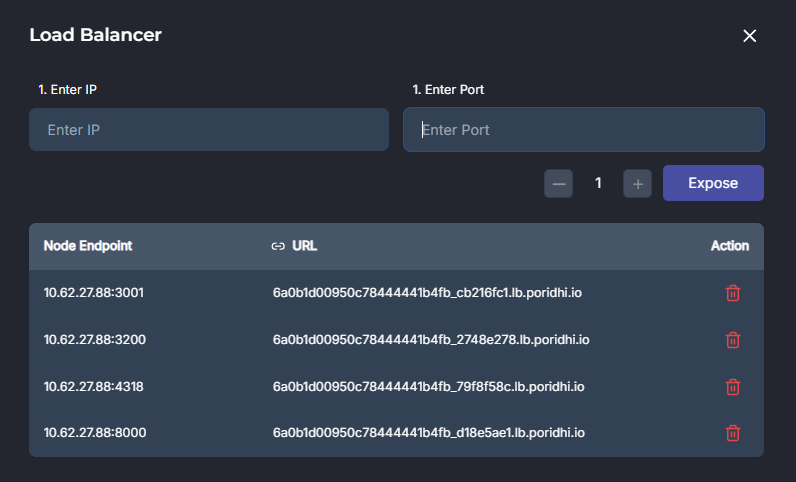
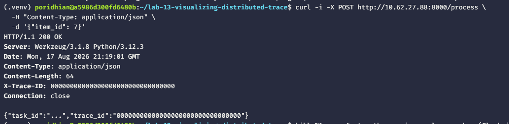
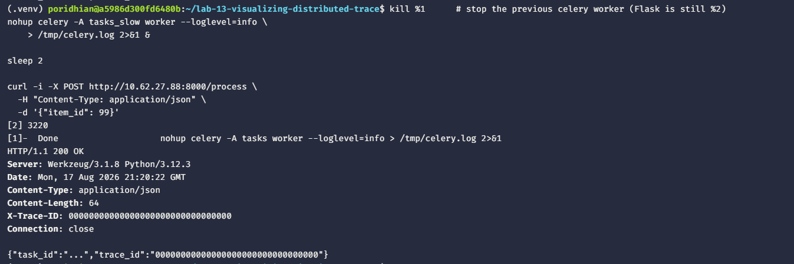
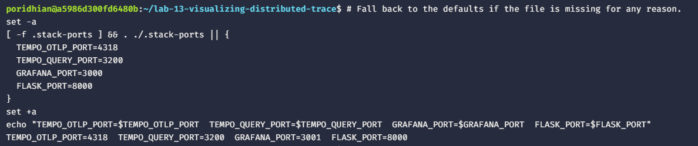

# Lab 13: Visualizing the End-to-End Distributed Trace in Grafana Tempo

Expose the trace ID on the Flask response, open the trace in Grafana, and read the waterfall and service graph to identify the slowest span.


## What You Will Build

- A Flask endpoint that exposes the trace ID under `X-Trace-ID`.
- A repeatable Tempo search flow by trace ID.
- A latency-injection experiment that confirms where the slow span lives.

## Prerequisites

- Docker Engine with the Compose plugin.
- Python 3.10 or newer. The setup script installs `python3.12-venv` and `python3-pip` (idempotent) before creating the venv.
- The setup script installs and starts `redis-server` if it is not already present.
- Host ports `4318`, `3200`, `3000`, and `8000` free. The setup script picks the next free port if any of the first four are already in use.

## Step 1 — Start the Grafana + Tempo stack, Redis, and the app

The bundled script `setup-lab13-stack.sh` brings up the Tempo + Grafana stack, installs and starts Redis, bootstraps the Python venv with Flask + Celery + Redis + the OTel SDK, and writes `tasks.py`, `app.py` (with the new `X-Trace-ID` response header), and `tasks_slow.py` (the latency-injection variant used in Step 7). It is idempotent.

```bash
mkdir -p lab-13-visualizing-distributed-trace
cd lab-13-visualizing-distributed-trace

# Pull the bundled setup script straight from the repo. Use the `Test`
# repo so you get the apt-first venv fix + nested-path guard.
curl -fsSL -o setup-lab13-stack.sh \
  https://raw.githubusercontent.com/mahiiabdullah/Test/main/Labs/lab-13-visualizing-distributed-trace/setup-lab13-stack.sh

chmod +x setup-lab13-stack.sh
./setup-lab13-stack.sh
```

If `curl` is missing, use `wget`:

```bash
wget -O setup-lab13-stack.sh \
  https://raw.githubusercontent.com/mahiiabdullah/Test/main/Labs/lab-13-visualizing-distributed-trace/setup-lab13-stack.sh
chmod +x setup-lab13-stack.sh
./setup-lab13-stack.sh
```

Load the chosen ports into your shell so every later step can reference them:

```bash
# Fall back to the defaults if the file is missing for any reason.
set -a
[ -f .stack-ports ] && . ./.stack-ports || {
  TEMPO_OTLP_PORT=4318
  TEMPO_QUERY_PORT=3200
  GRAFANA_PORT=3000
  FLASK_PORT=8000
}
set +a
echo "TEMPO_OTLP_PORT=$TEMPO_OTLP_PORT  TEMPO_QUERY_PORT=$TEMPO_QUERY_PORT  GRAFANA_PORT=$GRAFANA_PORT  FLASK_PORT=$FLASK_PORT"
```

The health-check lines at the end of the script (`Tempo ready?`, `Grafana ready?`, `Redis ready?`) should report `200`, `200`, and `PONG` respectively.





Verify the load balancer routes work:

```bash
curl http://<LB_IP>:${TEMPO_QUERY_PORT}/ready
curl http://<LB_IP>:${GRAFANA_PORT}/api/health
```



Both should return `200 OK` through the load balancer.

## Step 2 — Expose the stack + Flask through the load balancer

Open the **Load Balancer** modal in the lab UI. Find the IP to enter:

```bash
hostname -I
```


Use the **first** IP printed as `LB_IP`. Expose four ports, one at a time — substitute the port numbers your script actually printed:

| Enter IP | Enter Port |
|---|---|
| `LB_IP` | `$TEMPO_OTLP_PORT` (Tempo OTLP) |
| `LB_IP` | `$TEMPO_QUERY_PORT` (Tempo query) |
| `LB_IP` | `$GRAFANA_PORT` (Grafana UI) |
| `LB_IP` | `$FLASK_PORT` (Flask API) |

Default values are `4318`, `3200`, `3000`, and `8000`. Use whatever the script printed if it had to fall back.



Verify the load balancer routes work:

```bash
curl http://<LB_IP>:${TEMPO_QUERY_PORT}/ready
curl http://<LB_IP>:${GRAFANA_PORT}/api/health
```

Both should return `200 OK` through the load balancer.

## Step 3 — Start the Celery worker and Flask app

The setup script already created `.venv`, started Redis, and wrote `tasks.py` + `app.py`. Run the worker and the wrapped Flask app in the background so they survive the next `curl` command. Stop them with `kill %1 %2` when you finish.

```bash
source .venv/bin/activate

export OTEL_SERVICE_NAME=flask-api
export OTEL_EXPORTER_OTLP_ENDPOINT=http://localhost:${TEMPO_OTLP_PORT}
export OTEL_TRACES_EXPORTER=otlp
export OTEL_EXPORTER_OTLP_PROTOCOL=http/protobuf

nohup celery -A tasks worker --loglevel=info \
    > /tmp/celery.log 2>&1 &

nohup opentelemetry-instrument \
    --service_name flask-api \
    --exporter_otlp_endpoint "http://localhost:${TEMPO_OTLP_PORT}" \
    --exporter_otlp_protocol http/protobuf \
    -- flask --app app run --host=0.0.0.0 --port=${FLASK_PORT} \
    > /tmp/flask.log 2>&1 &

sleep 3
tail -n 5 /tmp/celery.log
echo '---'
tail -n 5 /tmp/flask.log
```



The worker log should show `ready`. The Flask log should show `Running on http://0.0.0.0:${FLASK_PORT}`.

## Step 4 — Trigger the request and capture the X-Trace-ID header

```bash
curl -i -X POST http://<LB_IP>:${FLASK_PORT}/process \
  -H "Content-Type: application/json" \
  -d '{"item_id": 7}'
```

The response now carries an `X-Trace-ID` header in addition to the `trace_id` JSON field. Save it for the next step.



`format(..., "032x")` produces a 32-character lowercase hex string. Setting it as a header makes the value reachable by any HTTP client.

## Step 5 — Open the trace in Grafana

Open `http://<LB_IP>:${GRAFANA_PORT}/explore`, pick the Tempo datasource, switch to **Search**, paste the trace ID, and click **Run query**.

The waterfall opens with two rows: `POST /process` as the root and `celery-process` as the child.

## Step 6 — Read the waterfall

The bar width is the span duration. The widest bar in the trace is the slowest operation. Click any bar to expand its attributes.

The `celery-process` bar is wider than the Flask bar. The worker is the slow part, not the API.

## Step 7 — Inject latency and confirm attribution

Restart the worker against the slow-worker variant, then trigger another request:

```bash
kill %1      # stop the previous celery worker (Flask is still %2)
nohup celery -A tasks_slow worker --loglevel=info \
    > /tmp/celery.log 2>&1 &

sleep 2

curl -i -X POST http://<LB_IP>:${FLASK_PORT}/process \
  -H "Content-Type: application/json" \
  -d '{"item_id": 99}'
```

Save the new `X-Trace-ID` and paste it into Tempo. The `celery-process` bar is now the widest by far. The latency is attributed to the worker, where it happened.



`tasks_slow.py` adds `time.sleep(2)` inside `do_work`. To go back to normal, restart the worker against `tasks` (`kill %1` then `nohup celery -A tasks worker --loglevel=info &`).

## Next Steps

Stop the worker and the wrapped Flask app with `kill %1 %2`. Stop the stack with `docker compose down`. Remove the four ports from the Load Balancer modal. The Labs 9–13 series now answers "why is this request slow?" from a single trace ID. The next module covers metrics and logs with Prometheus and Loki.